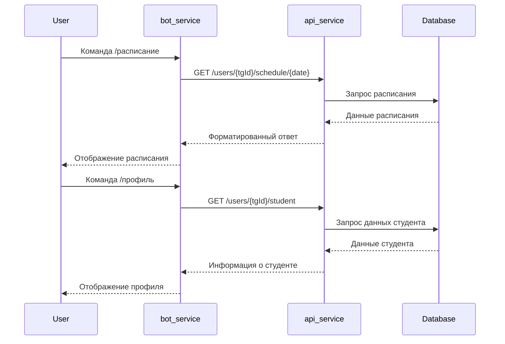

# Контракт между микросервисами bot_service и api_service

## Текущее состояние

### Существующие эндпоинты API (api_service)
1. **POST /auth** - аутентификация пользователя
   - Тело: `{ login, password, tgId }`
   - Ответ: `{ success, token?, reason? }`

2. **POST /users/:tgId/tasks** - создание задачи
   - Тело: `{ title, description, deadline, authorId }`
   - Ответ: `{ success, task?, reason? }`

3. **GET /users/:tgId/tasks** - получение задач пользователя
   - Ответ: `{ success, tasks[], reason? }`

4. **PUT /users/:tgId/tasks/:id** - обновление задачи
   - Тело: `{ title?, description?, deadline? }`
   - Ответ: `{ success, task?, reason? }`

5. **DELETE /users/:tgId/tasks/:id** - удаление задачи
   - Ответ: `{ success, task?, reason? }`

### Требования бота (bot_service)
- **Аутентификация** - уже реализована
- **Управление задачами** - уже реализовано
- **Получение расписания** - требуется эндпоинт (отсутствует)
- **Получение данных студента** - требуется эндпоинт (отсутствует)

## Анализ Prisma Schema

### Модели в базе данных
```prisma
model User {
    tg_id    Int      @id
    token    String
    tasks    Task[]
    students Student?
    schedules Schedule[]
}

model Student {
    id              Int    @id @default(autoincrement())
    course          Int
    department      String
    full_name       String
    group           String
    record_book_id  Int
    semester        Int
    study_direction String
    study_profile   String
    year            String
    userId          Int    @unique
    user            User   @relation(fields: [userId], references: [tg_id])
}

model Schedule {
  id        Int      @id @default(autoincrement())
  tg_id     Int
  user      User     @relation(fields: [tg_id], references: [tg_id])
  semester  String
  week      Int
  weekType  Int
  dayOfWeek Day
  lessons   Lesson[]
}

model Lesson {
  id            Int      @id @default(autoincrement())
  lesson_number Int
  lesson_name   String
  lesson_type   String
  teacher       String
  classroom     String
  scheduleId    Int
  schedule      Schedule @relation(fields: [scheduleId], references: [id])
}
```

### Соответствие потребностям бота
- **Данные студента** - модель Student содержит все необходимые поля
- **Расписание** - модели Schedule и Lesson соответствуют требованиям
- **Несоответствия**: 
  - В модели Schedule поле `weekType` имеет тип Int, но в боте ожидается string
  - В модели Lesson отсутствуют поля `start` и `end` (только lesson_number)
  - В боте ожидается поле `date` в расписании, но в модели его нет

## Спецификация контракта

### Новые эндпоинты API

#### 1. GET /users/:tgId/schedule/:date
**Назначение**: Получение расписания на конкретную дату
**Параметры**:
- `tgId` - ID пользователя в Telegram
- `date` - дата в формате YYYY-MM-DD

**Ответ**:
```typescript
{
  success: boolean,
  schedule?: {
    week: number,
    weekType: string, // "числитель"/"знаменатель"
    dayOfWeek: string, // "Monday".."Sunday"
    date: string, // ISO дата
    lessons: Array<{
      lesson_name: string,
      lesson_type: string,
      lesson_number: number,
      start: string, // ISO время
      end: string,   // ISO время
      teacher: string,
      classroom: string
    }>
  },
  reason?: string
}
```

#### 2. GET /users/:tgId/student
**Назначение**: Получение информации о студенте
**Ответ**:
```typescript
{
  success: boolean,
  student?: {
    course: number,
    department: string,
    full_name: string,
    group: string,
    record_book_id: number,
    semester: number,
    study_direction: string,
    study_profile: string,
    year: string
  },
  reason?: string
}
```

### Общие требования к контракту

1. **Стандартный формат ответа**:
```typescript
interface ApiResponse<T> {
  success: boolean;
  data?: T;
  reason?: string;
}
```

2. **Коды состояния HTTP**:
   - 200 - успех
   - 400 - ошибка валидации
   - 404 - ресурс не найден
   - 500 - внутренняя ошибка сервера

3. **Заголовки**:
   - Content-Type: application/json
   - Авторизация через токен в заголовке (если потребуется)

## План реализации

### Этап 1: Модификация Prisma Schema
1. Добавить поля `start_time` и `end_time` в модель Lesson
2. Изменить тип `weekType` с Int на String в модели Schedule
3. Добавить поле `date` в модель Schedule (или вычислять из week/dayOfWeek)

### Этап 2: Реализация эндпоинтов в api_service
1. Создать контроллер для расписания (`schedule.controller.ts`)
2. Создать репозиторий для работы с расписанием
3. Создать контроллер для данных студента (`student.controller.ts`)
4. Обновить `routes.ts` для добавления новых маршрутов

### Этап 3: Обновление сервисов в bot_service
1. Создать `student.service.ts` для получения данных студента
2. Обновить `schedule.service.ts` для использования нового эндпоинта
3. Обновить схемы валидации в соответствии с новым контрактом

### Этап 4: Интеграция и тестирование
1. Протестировать новые эндпоинты через Postman
2. Обновить обработчики бота для использования новых сервисов
3. Проверить корректность отображения данных в боте

## Диаграмма взаимодействия



## Рекомендации

1. **Версионирование API**: Рассмотреть добавление префикса `/api/v1/` к маршрутам
2. **Документация**: Создать OpenAPI спецификацию для всех эндпоинтов
3. **Обработка ошибок**: Унифицировать форматы ошибок между сервисами
4. **Кэширование**: Для данных расписания реализовать кэширование на стороне бота
5. **Валидация**: Использовать Zod схемы для валидации входящих данных в обоих сервисах

## Следующие шаги

1. Утвердить спецификацию контракта
2. Переключиться в режим Code для реализации изменений
3. Начать с модификации Prisma Schema и создания миграций
4. Поэтапно реализовать новые эндпоинты
5. Протестировать интеграцию